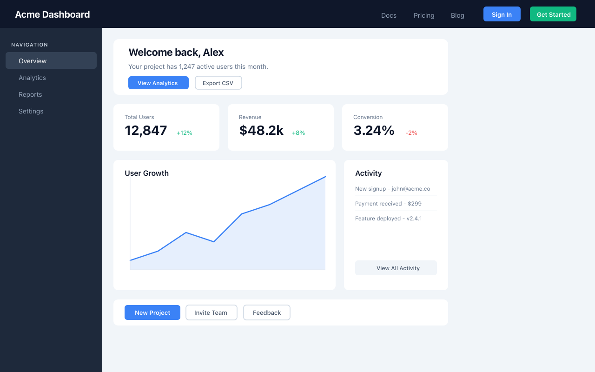
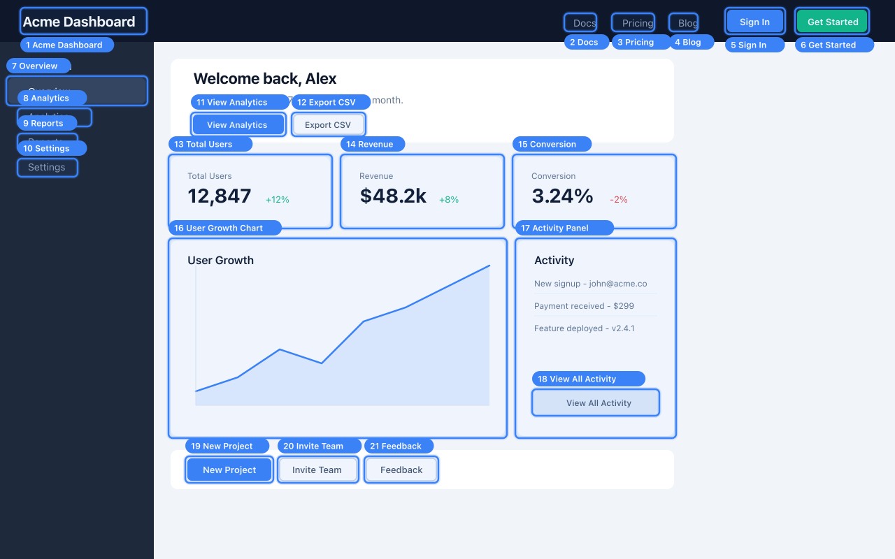
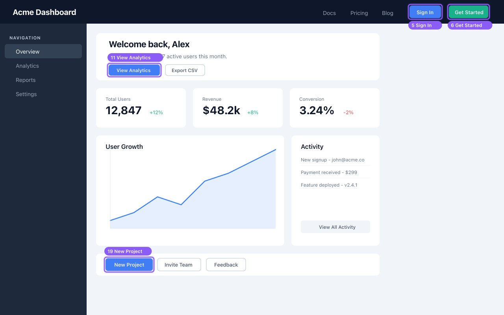
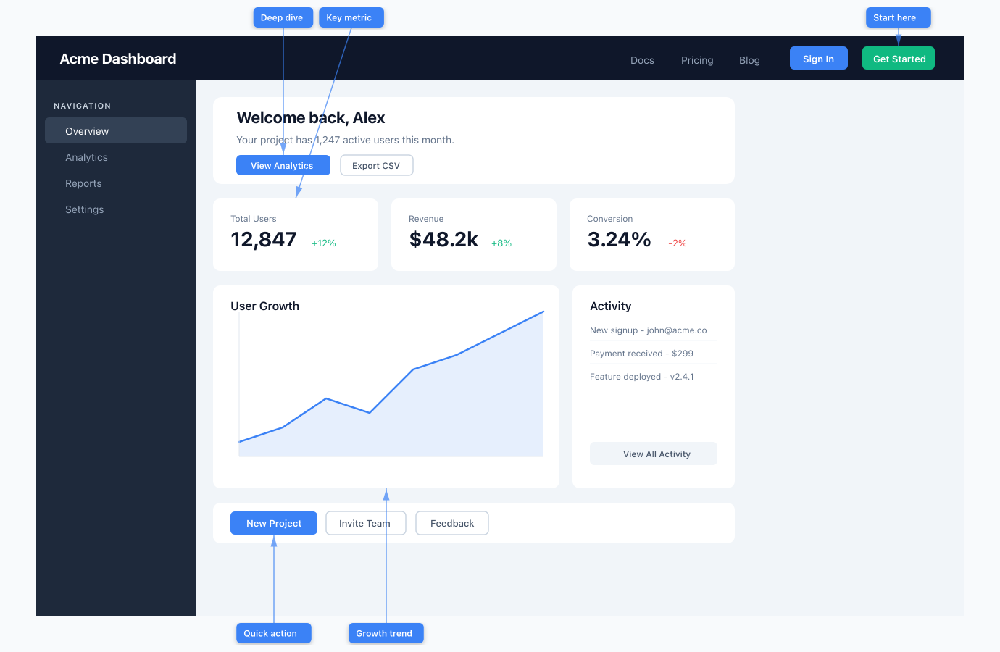
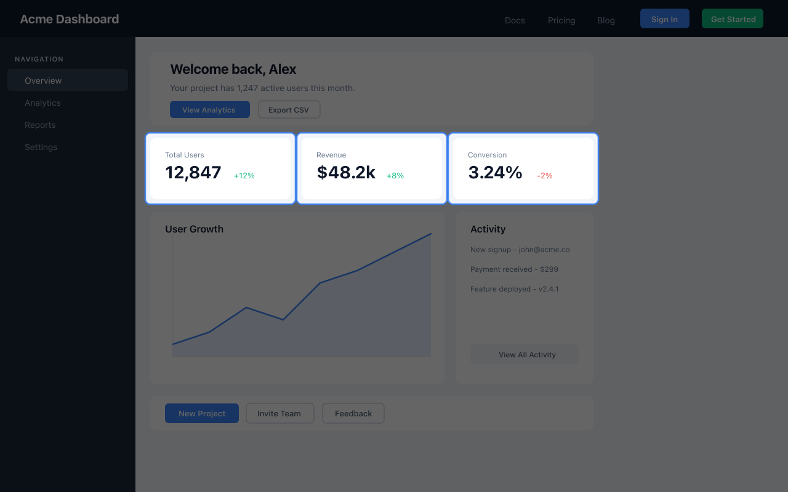
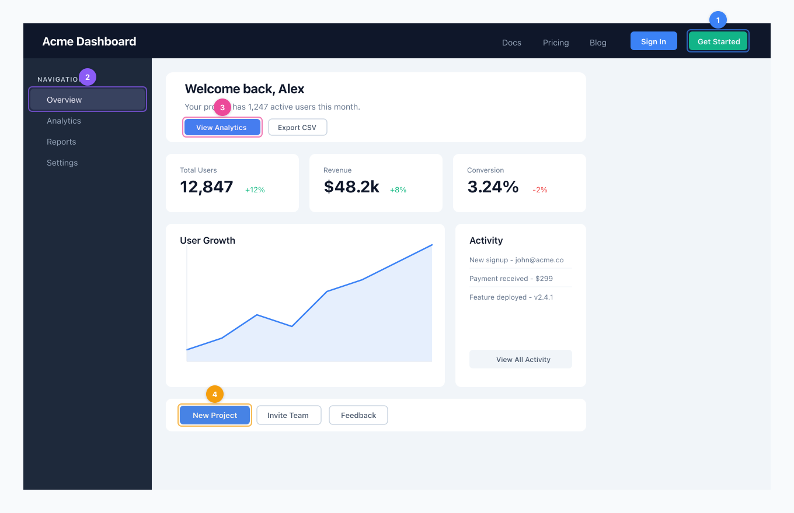

# annotate

Post-process browser screenshots with clean visual annotations. Works standalone or piped directly from [agent-browser](https://github.com/vercel-labs/agent-browser).

<p align="center">
  
  
</p>

## Install

```bash
bun install
```

Or build a standalone binary:

```bash
bun run build
# produces ./annotate
```

## Modes

### Boxes

Rounded rectangles with numbered pill labels. Default mode.

```bash
annotate screenshot.png annotations.json --mode boxes
annotate screenshot.png annotations.json --mode boxes --only e5 e6 --color "#8B5CF6"
```



### Arrows

Labels placed outside the screenshot in a frame, with arrows pointing inward. Best for callouts.

```bash
annotate screenshot.png annotations.json --mode arrows \
  --only e6 e11 e19 \
  --label e6="Start here" \
  --label e11="Deep dive" \
  --label e19="Quick action"
```



### Spotlight

Dims everything except selected elements.

```bash
annotate screenshot.png annotations.json --mode spotlight --only e13 e14 e15
annotate screenshot.png annotations.json --mode spotlight --only e19 e20 --color "#10B981" --dim-opacity 0.7
```



### Flow

Numbered badges showing a sequence of steps.

```bash
annotate screenshot.png annotations.json --mode flow --only e6 e7 e11 e19 --frame 40
```



## Usage with agent-browser

The CLI accepts `agent-browser screenshot --annotate --json` output directly — it extracts the image path and annotations automatically.

```bash
# Pipe directly
agent-browser screenshot --annotate --json | annotate --mode boxes -o annotated.png

# Or save and annotate
agent-browser screenshot --annotate --json > shot.json
annotate shot.json --mode spotlight --only e1 e5

# Arrows with custom labels
agent-browser screenshot --annotate --json | annotate --mode arrows \
  --only e3 e7 \
  --label e3="Click here" \
  --label e7="Then here"
```

## Standalone usage

Pass an image and a separate annotations JSON file:

```bash
annotate screenshot.png annotations.json --mode boxes
```

### Annotations JSON format

```json
[
  {
    "ref": "e1",
    "number": 1,
    "role": "button",
    "name": "Submit",
    "box": { "x": 100, "y": 200, "width": 150, "height": 40 }
  }
]
```

## Options

```
-m, --mode <mode>          boxes|arrows|spotlight|flow (default: boxes)
-o, --output <path>        Output path (default: <image>-annotated.png)
--only <refs...>           Filter to specific refs (e.g., e1 e5 @e12)
--label <ref=text>         Custom label per ref (repeatable)
--color <hex>              Primary color (default: #3B82F6)
--padding <px>             Box padding (default: 3)
--min-box-size <px>        Minimum box size for small elements
--dim-opacity <0-1>        Spotlight dim opacity (default: 0.6)
--frame <px>               Frame around image (default: 0, auto for arrows)
--frame-color <hex>        Frame color (default: #F8FAFC)
```

## Programmatic API

```typescript
import { annotate } from "./src/annotate";

const result = await annotate("screenshot.png", annotations, {
  mode: "spotlight",
  only: ["e1", "e5"],
  color: "#10B981",
});

await Bun.write("output.png", result);
```

## Claude Code Skill

A skill definition is included at `skills/annotate/SKILL.md` for use with Claude Code's agent-browser skill system.

## License

MIT
